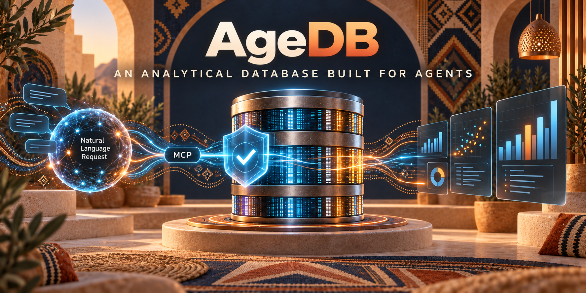

# AgeDB


[](https://github.com/sivsivsree/agedb/actions/workflows/ci.yml)
[](LICENSE)
[](https://rustup.rs)



**An analytical database built for agents to use directly.** Columnar storage with a
write-ahead log, a vectorized query engine, and MCP as a first-class interface, so an agent
can create a table, load rows into it, and ask questions in plain language without ever
generating SQL.

```
Agent: "Create a table for the leads I'm collecting."
Agent: "Store these 4,000 leads."
Agent: "Which companies look most likely to convert?"
```

Status: v0.1, single node, 301 tests. Written in Rust. Contributions welcome, and the
[known gaps](ARCHITECTURE.md#known-gaps) are a good place to start.


## Why this exists

Agents now collect and analyze data as a matter of course, and they have two bad options.

**Option one: a normal analytical database plus text-to-SQL.** The failure mode is silent.
A model writes `SELECT SUM(amount) FROM orders WHERE country = 'UK'`, the column is
actually `country_code`, and instead of an error the agent gets an exception it retries
around, or worse, a query that runs against the wrong column and returns a plausible number.
Nothing in the stack knows that `customer_id` is an identifier rather than a quantity, so
`SUM(customer_id)` executes happily. Nothing bounds the query, so one careless `GROUP BY`
scans the whole table. Permissions are per-connection, not per-agent-capability, and
multi-tenancy is an application concern that one forgotten `WHERE tenant_id = ?` undoes.

**Option two: a document store or a spreadsheet.** Safe, and useless for analysis past a few
thousand rows.

agedb takes the position that the interface *is* the product:

| The problem | What agedb does |
| --- | --- |
| Generated SQL fails silently | Agents call typed tools. A wrong column name is `not_found` with the real column names listed |
| A model invents columns or aggregations | Models emit a structured plan, never executable operations. A validator checks it against the real schema before anything runs |
| Schemas describe storage, not meaning | Columns carry `semantic_type`, `description`, units, currency, default aggregation and relationships. `sum(id)` is refused as meaningless |
| Queries are unbounded | Row, byte and time budgets are enforced inside execution, and a truncated result says so |
| You cannot tell how a question was read | Every response echoes the plan that ran, plus what was scanned and pruned |
| Multi-tenancy is application-level filtering | Tenant identity selects the storage prefix, so a missed check cannot leak another tenant's rows |
| Sensitive columns end up in prompts | Columns marked `sensitive` are excluded from `select *` and from anything sent to a model |
| Analytics needs are real | Columnar segments, statistics-based pruning, and a vectorized Arrow executor underneath |

## Quickstart

Requires Rust 1.90 or newer ([rustup](https://rustup.rs)). No other dependencies, no server
to install, no Docker needed.

```bash
git clone https://github.com/sivsivsree/agedb
cd agedb
cargo build --release
```

See the whole thing work in about 40 seconds:

```bash
examples/demo.sh
```

That starts a server, creates a table, loads 4,000 leads, asks six plain-language questions,
shows what an error looks like, then replays the same tools over MCP on stdio.

### As an MCP server

```bash
./target/release/agedb --data-dir ./data serve --transport stdio
```

Registering it with an MCP client, for example in `.mcp.json`:

```json
{
  "mcpServers": {
    "agedb": {
      "command": "/absolute/path/to/agedb",
      "args": ["--data-dir", "/absolute/path/to/data",
               "serve", "--transport", "stdio", "--tenant", "acme"]
    }
  }
}
```

### Over HTTP

```bash
./target/release/agedb --data-dir ./data \
  serve --transport http --port 8080 --api-key dev-key --tenant acme
```

```bash
H=(-H 'authorization: Bearer dev-key' -H 'content-type: application/json')

curl -sS -X POST localhost:8080/v1/databases "${H[@]}" -d '{"database":"sales"}'

curl -sS -X POST localhost:8080/v1/databases/sales/tables "${H[@]}" -d '{
  "table":"orders","primary_key":["id"],
  "columns":[
    {"name":"id","type":"int64","nullable":false,"semantic_type":"id"},
    {"name":"country","type":"utf8","semantic_type":"country"},
    {"name":"amount","type":"float64","semantic_type":"currency","default_aggregation":"sum"}]}'

curl -sS -X POST localhost:8080/v1/databases/sales/tables/orders/rows "${H[@]}" -d '{
  "rows":[{"id":1,"country":"uae","amount":12000},
          {"id":2,"country":"usa","amount":8400},
          {"id":3,"country":"uae","amount":19300}]}'

curl -sS -X POST localhost:8080/v1/databases/sales/query "${H[@]}" \
  -d '{"request":"total amount by country in orders"}'
# {"rows":[{"country":"uae","sum_amount":31300.0},{"country":"usa","sum_amount":8400.0}], ...}
```

Full operator guide, including config files, scopes and troubleshooting:
[`docs/usage.md`](docs/usage.md).

## The agent interface

Fourteen tools, no query language, and no escape hatch. There is deliberately no
`execute_arbitrary_query`:

```
database_create   table_create     data_insert   data_query
database_list     table_list       data_upsert
database_delete   table_describe   data_get
                  table_drop       data_delete
                  schema_get
                  schema_update
```

`data_query` accepts plain language or a structured plan:

```json
{ "request": "total revenue by country in the last 30 days" }
```

```json
{
  "plan": {
    "operation": "aggregate",
    "table": "orders",
    "filters": [{ "column": "created_at", "op": "gte", "value": "2026-08-01" }],
    "group_by": ["country"],
    "metrics": [{ "function": "sum", "column": "amount", "alias": "revenue" }],
    "order_by": [{ "column": "revenue", "direction": "desc" }],
    "limit": 20
  }
}
```

Either way, the response carries the plan that ran, so an agent can check the interpretation
and reuse or adjust it:

```json
{
  "rows": [{ "country": "uae", "revenue": 3458839.12 }],
  "interpretation": "reading orders (grouped by country; sum(amount))",
  "plan": { "operation": "aggregate", "...": "..." },
  "stats": { "elapsed_ms": 1, "rows_scanned": 4000, "segments_pruned": 24 },
  "warnings": []
}
```

Natural language works with no API key at all, through a deterministic translator that
handles counts, sums, averages, min/max, group-bys, top-N, comparisons, null checks and time
windows, and refuses what it cannot do rather than guessing. Set `ANTHROPIC_API_KEY` to
route translation through a hosted model instead, with the plan schema as a forced tool call.

## Architecture

One idea explains most of the design: **every front end converges on one validated Query
IR.** Natural language, structured plans and (later) SQL all lower into the same
representation, which is validated once, in one place, before anything executes.

```
                     Agents / LLMs
                           │
             MCP (stdio or HTTP)   REST
                           │        │
                  ┌────────▼────────▼────────┐
                  │  adb-mcp  /  adb-api     │  auth, scopes, per-key limits
                  └────────────┬─────────────┘
                               │
                  ┌────────────▼─────────────┐
                  │        adb-engine        │  catalog, tables, request context
                  └────────────┬─────────────┘
                               │
        ┌──────────────────────┼──────────────────────┐
        │                      │                      │
┌───────▼────────┐   ┌─────────▼────────┐   ┌──────────▼─────────┐
│   adb-query    │   │   adb-planner    │   │      adb-exec      │
│ NL to plan JSON│──▶│ plan to IR to    │──▶│ vectorized Arrow   │
│ (rules or LLM) │   │ validated plan   │   │ operators          │
└────────────────┘   └──────────────────┘   └──────────┬─────────┘
                                                       │
                                            ┌──────────▼─────────┐
                                            │    adb-storage     │
                                            │ WAL, memtable,     │
                                            │ segments, manifest │
                                            └──────────┬─────────┘
                                                       │
                                              filesystem (S3-shaped keys)
```

| Crate | Responsibility |
| --- | --- |
| `adb-core` | Identifiers, type system, semantic schema, versioned catalog, request context |
| `adb-storage` | WAL, memtable, Parquet segments, manifests, key index, compaction |
| `adb-planner` | Query IR, validator, optimizer, physical plan |
| `adb-exec` | Vectorized operators over Arrow, budgets and statistics |
| `adb-query` | Natural language to structured plan, schema retrieval |
| `adb-engine` | The facade: catalog, tables and the query path |
| `adb-mcp` | MCP tools, JSON-RPC, API keys and scopes |
| `adb-api` | REST, plus MCP over HTTP |
| `adb-server` | The `agedb` binary |

Underneath: writes go to a write-ahead log then a memtable, flush into immutable Parquet
segments carrying min/max statistics and bloom filters, and updates suppress old rows by
bitmap rather than rewriting files. Queries prune segments from statistics before reading
anything.

[`ARCHITECTURE.md`](ARCHITECTURE.md) has the design rationale, on-disk formats, concurrency
model, benchmarks and the list of what is deliberately missing.

## Testing criteria

Every change must keep these green. CI runs all of them on each pull request:

```bash
cargo fmt --all --check                                   # formatting
cargo clippy --workspace --all-targets -- -D warnings     # no warnings, at all
cargo test --workspace                                    # 301 tests, about 15 seconds
examples/demo.sh                                          # end-to-end smoke test
```

The suite is built around four kinds of test, and a change is expected to extend whichever
applies:

| Kind | Where | What it protects |
| --- | --- | --- |
| Unit tests | next to the code, in `#[cfg(test)]` | Behaviour of one function, including its error cases |
| Correctness oracle | `crates/adb-exec/tests/query.rs` | The vectorized engine agreeing with a naive row-at-a-time implementation over the same data |
| Durability | `crates/adb-engine/tests/engine.rs` | Acknowledged writes surviving a hard kill, verified by aborting a child process mid-write |
| Protocol | `crates/adb-mcp/tests/`, `crates/adb-api/tests/` | Real JSON-RPC frames and real HTTP requests, not internal function calls |

What a contribution is expected to bring:

* **New behaviour**: a test that fails without the change.
* **A bug fix**: a regression test that reproduces the bug first.
* **Executor or planner changes**: an oracle case, because subtle wrongness there is
  invisible otherwise.
* **Storage format changes**: a durability test, plus a note in `ARCHITECTURE.md` if the
  on-disk format moved.
* **Performance work**: before and after numbers from
  `cargo run --release -p bench -- --rows 2000000`.

Tests must be deterministic. Where data is generated, seed it (see `Rng` in
`crates/adb-exec/tests/query.rs`), and never depend on wall-clock time. The natural language
layer takes an injected clock for exactly this reason.

## Contributing

Start with [`CONTRIBUTING.md`](CONTRIBUTING.md). The short version: fork, branch, make the
four commands above pass, open a pull request explaining the why.

Good first contributions:

* Pick something from [known gaps](ARCHITECTURE.md#known-gaps), such as vectorizing grouped
  aggregation or persisting the key index.
* Add cases to the natural language corpus in `crates/adb-query/tests/nl.rs`. Every question
  an agent asks that gets refused is a small, self-contained improvement.
* Extend the query surface, for example `HAVING`, `DISTINCT`, or `NOT IN` pruning.
* Improve an error message. Every error an agent reads is part of the interface.

One repository rule worth stating up front: **no em dashes anywhere**, in code, comments,
documentation or commit messages. CI enforces it.

## Roadmap

v0.1 is a single node with the storage, planning, execution and interface layers complete.
Next, roughly in order:

1. Joins and `HAVING`, which the IR already has a shape for.
2. Vector and full-text search alongside the relational operators.
3. A SQL front end feeding the same IR.
4. Raft replication for high availability. The `LogStore` seam exists for it, which is why
   log application is already deterministic.
5. S3, R2 and GCS object store backends.
6. A control plane and a web dashboard.

## License

Apache License 2.0. See [LICENSE](LICENSE).
